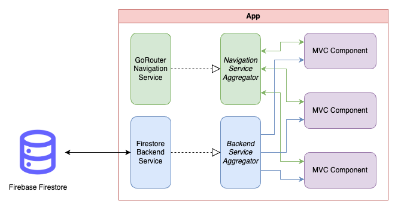

# MediSupport

## Abstract
MediSupport is a helper app designed to share medical knowledge with a wide variety of people. Users are able to react, interact, and obtain medical knowledge for their own benefit. Posts created by verified medical staff are the foundation for healthy and intriguing discussions.

## Description
The goal is to make medical information accessible for everybody. Nowadays, the internet is full of fake news, intentionally and unintentionally shared wrong medical information. By creating a moderated and safe environment, users can read up on day-to-day medical topics that they are interested in. They can share their stories or issues and request help from certified medical staff. Because everyone is able to engage in the discussions, people get their questions answered, and wrong information will be corrected.

### Targeted Problem
The main problem we try to fix is the lack of medical knowledge among common people. This leads to overworked and overbooked doctors. By solving this issue, people who dearly need help can actually get appointments with doctors, since they are no longer held back by small and insignificant problems that people can fix themselves.

### Target Groups
Our primary target group is the German low and middle class, as well as elderly people and medical students who we believe could very much benefit from this project as well.

## Screens
Our application features a wide variety of screens and features to ensure maximum user engagement.

### Home / Dashboard
The landing page of the app and the initial screen the user will be greeted with upon opening the application for the first time. Here the user can see the most recent posts and get an overview of all available features.

#### Post Details
When interested in a post, a user can tap on it and read the full length of the content. On top of that, they are also able to reply to the post itself or to any of the replies by other users.

#### Search
When the user is interested in a specific topic, they are able to search for keywords through all posts. Some of the most common categories are also displayed as recommendations. Upon searching, all matching posts will be displayed in a very short form.

  
  

### Create a Post
Here the user can easily create a new post with a title and some content. They are able to submit their new post or discard it if they are unsure of it.

### Chats
An overview page for all personal chats with other users. Here the user also has the possibility to search/filter through their chats by message or name.

#### Chat Details
A page containing the chat between the currently logged-in user and the participant. A user is able to read previous messages, send new messages, or delete a message.

### Profile
An overview of all personal data the user has registered. Currently, we support avatar, full name, description, email, password, and phone number. The user is able to edit all fields but the avatar image.

## Architektur
We decided to use MVC+S architecture with the dependency inversion principle. This means each feature consists of three main components and variable amounts of service interfaces. The three main components are the Model, View, and Controller. The Model defines the data structure used by the feature/component. It's instantiated in the Controller, which holds the business logic, handles state updates, and communicates with any needed service. The View is a pure visualization of the data defined by the Model.

### App-Structure and Layers
We decided to go with a feature-based structuring instead of layer-based structuring. This way, each component has no dependencies on any other component, and the files for that component are grouped in one place. This makes refactoring and editing components very easy. Below you can see a diagram of how the components are structured and how they interact with each other.

These MVC-Components are then assigned a route from (usually) the navigation service, which allows them to be accessed and pushed onto the navigation stack. 
Below you can see how the app is structured using the MVC-Components and how they communicate with the services. 

