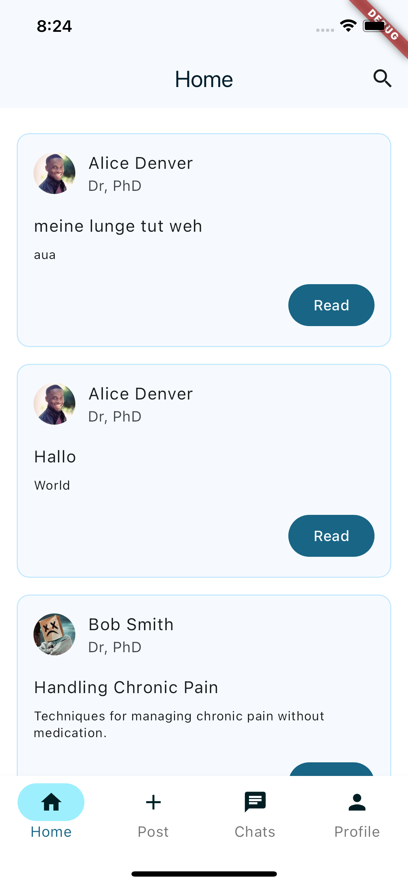
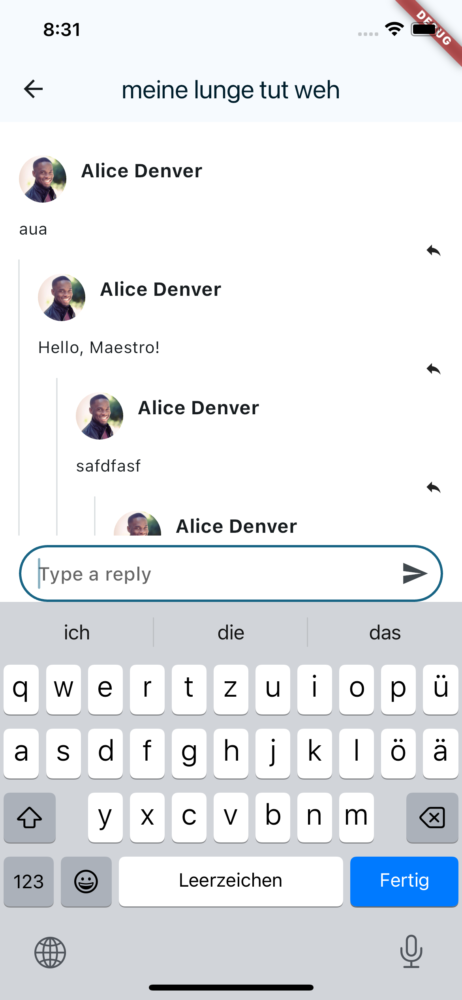
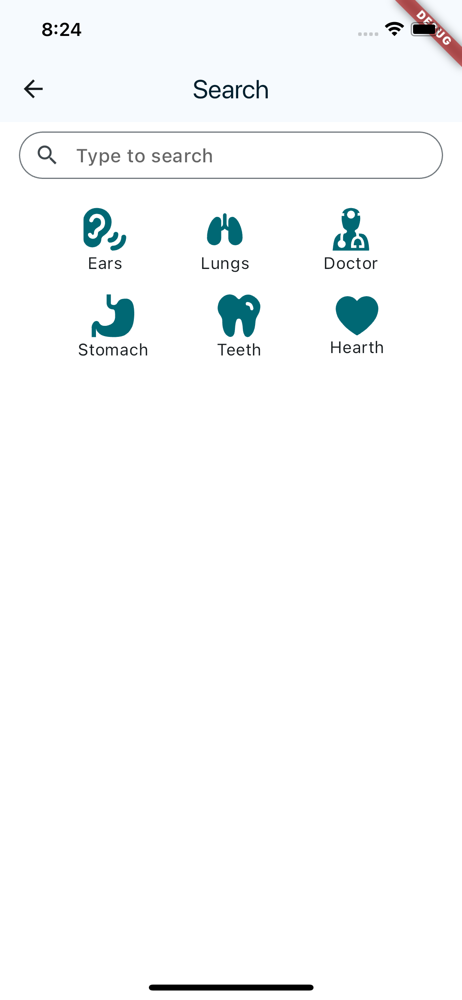
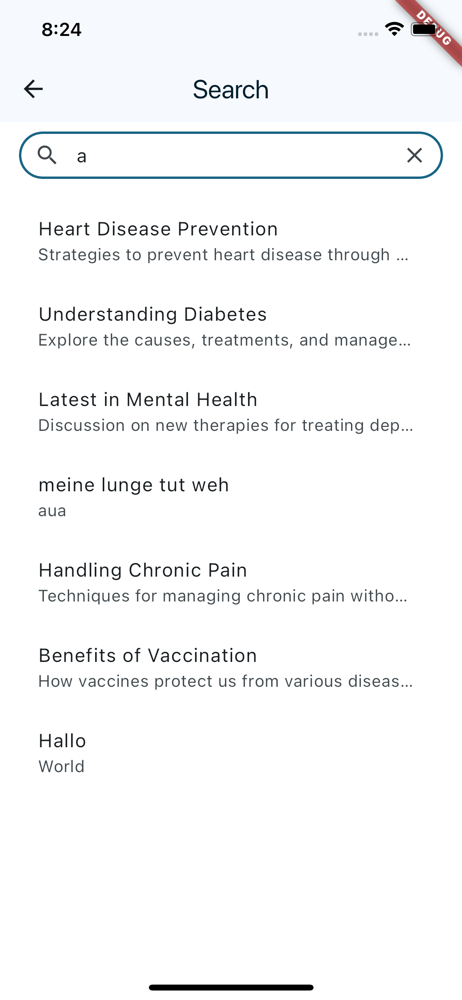
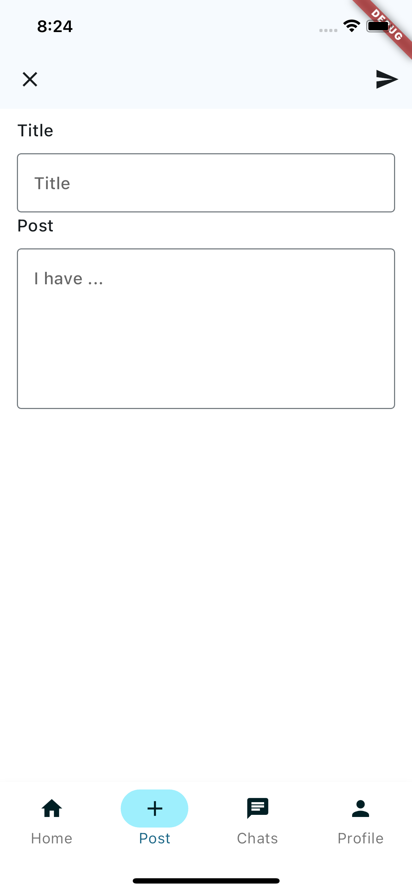
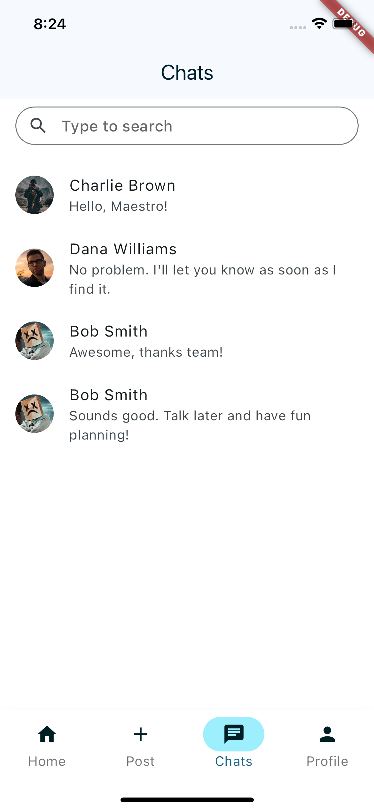
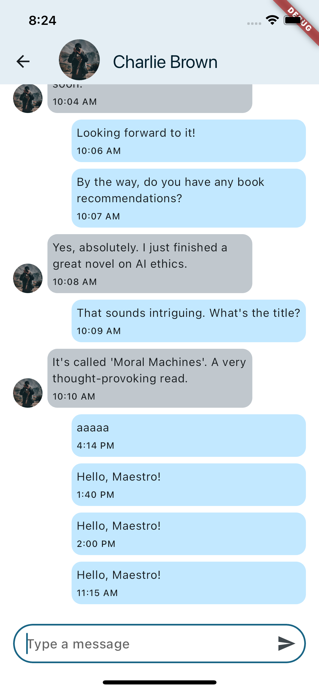
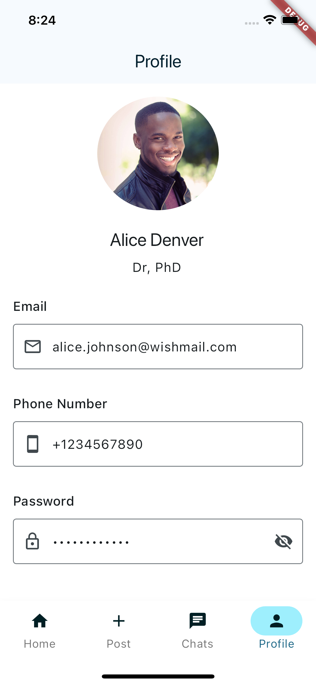
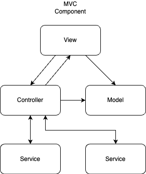

# MediSupport

## Abstract
MediSupport is a helper app designed to share medical knowledge with a wide variety of people. 
Users are able to react, interact and obtain medical knowledge for their own benefit. 
Posts created by verified medical staff are the foundation for healthy and intriguing discussions. 

## Description
The Goal is to make medical information accessable for everybody. Nowadays the internet is full of fake news, 
intentionally and unintentionally shared wrong medical information. By creating a moderated and safe environment users can 
read up on day to day medical topics that they are interessted in. They can share their stories or issues and request help
by zertified medical staff. Because everyone is able to engage in the discussions, people get their questions answered and wrong information will be corrected. 

### Targeted Problem
The main problem we try to fix is the lack of medical knowledge among the common person. This leads to overworked and overbooked 
doctors. By solving this issue people who dearly need help can actually get appointments at doctors, since they are no longer held back from small and insignificant problems that people can fix themself. 

### Target groups
Our target group is primarely the German low and middle class. After that we believe that this Project could also be very hepful for elderly people and medical students. 

## Screens
Our application features a wide variety of screens and features to ensure a maximum of user engagement. 

### Home / Dashboard
The landing page of the app and the initial screen the user will be greeted with upon opening the application for the first time.
Here the user can see the most recents posts and get an overview of all available features. 

#### Post details
When interessted in a Post, a user can tap on it and read the full length of the content. On top of that he is also able to reply to the Post it self or to any of the replies by other users. 

#### Search
When the user is interessted in a specific topic he is able to search for keywords through all posts. Some of the most common categories are also displayed as recommendations. Upon searching, all posts matching will be displayed in a very short form.

  
  

### Create a post
Here the user can easily create a new Post with a title and some content. He is able to submit his new post or discard if he is unsure of it.

### Chats
An overview page for all personal chats with other users. Here the user also has the possibility to search / filter through his chats by message or name.

#### Chat details
A page containing the chat between the currently logged in user and the participant. A user is able to read previous messages, send new messages or delete a message. 

### Profile
An overview of all Personal data the user has regstered. Currently we support avatar, fullname, description, email, password and phonenumber. The user is able to edit all fields but the avatarImage.

## Architektur
We decided to use MVC+S architecture with dependency inversion principle. This means each feature consists of three main components and 
variable amounts of service interfaces. The three main components are the Model, View and Controller. The Model defines the data structure used by the feature / component. Its instantiated in the Controller which holds the business logic, handles state updates and communication with any needed service. The view is a pure visualization of the data defined by the model. 

### App-Structure and layers
We decided to go with a feature based structuring instead of layer based structuring. This way each component has no dependencies to any other component and the files for that component are grouped in one place. This makes refactoring and editing component very easy. 
Below you can see a diagram of how the components are structured and how they interact with each other. 

