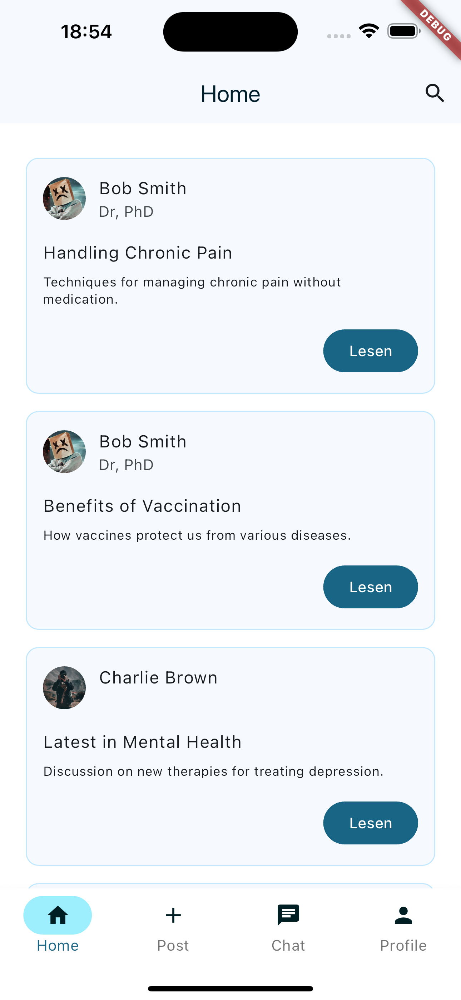
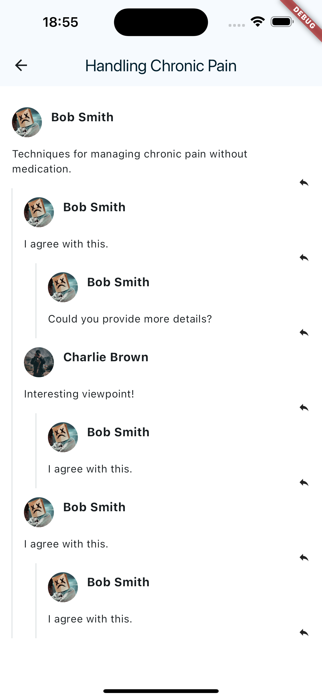

# mobile_anwendungen - Medi Support

## Abstract
Slogan: "Professional health advice with knowledge transfer for everyone"
With our app, we try to simplify the exchange of knowledge about common complaints and diseases.
We want to offer a platform that makes this possible.

## Description
Everyone knows it, you feel unwell or not really healthy and search the internet for possible causes. Suddenly you're close to death or don't have long to live. But nowadays there's also a lot of nonsense on the Internet and you can't really be sure whether the source you're reading is really serious.
This is where Medi Supp can help. It is to become an app where people can inform themselves with a clear conscience about all kinds of complaints and illnesses. In addition, the app should also have an advisory function so that people can get a possible diagnosis from specialists or from fellow sufferers who have already overcome the complaint or illness and can give tips

### Problem Solving
The aim is
- To offer publicly accessible information exchange on all aspects of health complaints
- to cover a very broad spectrum: from hay fever to serious illnesses
- To stimulate discussion between users and specialists
- professional advice from specialists and people who have already gone through the same illnesses / complaints

### Personas
Medical professionals:
- Healthcare professionals of all kinds (from nurses to surgeons) can advise people
- Precautionary advice may save unnecessary visits to the doctor
Average citizen:
- gets a source of information
- can exchange information
- can get professional help online
People of advanced age:
- in addition to the points above, a kind of community building is encouraged for people who have difficulty getting out of the house

## Screens & Functionalities

## Architecture
